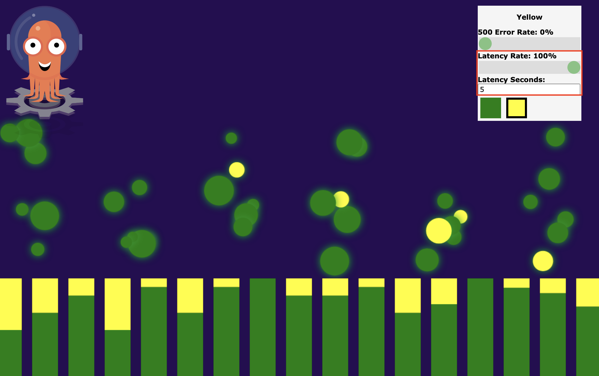

# AIOps Canary Releases with NewRelic and Argo Rollouts

[NewRelic Applied Intelligence](https://docs.newrelic.com/docs/alerts-applied-intelligence/new-relic-alerts/get-started/introduction-applied-intelligence/) spots unusual changes across all applications, services, and log data with automatic alerts based on golden signals like throughput, errors, and latency — with no configuration needed, [Proactive Detection](https://docs.newrelic.com/docs/alerts-applied-intelligence/applied-intelligence/proactive-detection/proactive-detection-applied-intelligence/), for example, is automatically enabled and available at no additional cost. All that's required is data from your APM-monitored applications flowing into New Relic.

Using the NewRelic AIOps power to drive [Canary](https://martinfowler.com/bliki/CanaryRelease.html) releases can make your application deployment safer, faster, and easier to set up, ensuring that only healthy versions of your application reach production. We can literally go from zero to fully monitored canaries in minutes.

This post assumes you already have installed and are familiar with Kubernetes, Docker, Service Mesh, and [Canary](https://martinfowler.com/bliki/CanaryRelease.html) concepts. The main goal is to give you an overview of Argo Rollouts [Analysis](https://argoproj.github.io/argo-rollouts/features/analysis/) powered by NewRelic AIOps [Proactive Detection](https://docs.newrelic.com/docs/alerts-applied-intelligence/applied-intelligence/proactive-detection/proactive-detection-applied-intelligence/) and maybe be an inspiration to help you find the paved road to safer deploys. All examples presented are specific for this demo application and should not be used as a common recipe for canary releases.


### Requirements

- Kubernetes cluster or [minikube](https://minikube.sigs.k8s.io/docs/start/)
- [Docker](https://www.docker.com/get-started) 
- [Istio](https://istio.io/latest/docs/setup/install/)
- [Argo Rollouts](https://argoproj.github.io/argo-rollouts/)


### Argo Rollouts

> Argo Rollouts is a Kubernetes controller and set of CRDs which provide advanced deployment capabilities such as blue-green, canary, canary analysis, experimentation, and progressive delivery features to Kubernetes.
>
> Argo Rollouts (optionally) integrates with ingress controllers and service meshes, leveraging their traffic shaping abilities to gradually shift traffic to the new version during an update. Additionally, Rollouts can query and interpret metrics from various providers to verify key KPIs and drive automated promotion or rollback during an update.
>
> ## Features
>
> - Blue-Green update strategy
> - Canary update strategy
> - Fine-grained, weighted traffic shifting
> - Automated rollbacks and promotions
> - Manual judgment
> - Customizable metric queries and analysis of business KPIs
> - Ingress controller integration: NGINX, ALB
> - Service Mesh integration: Istio, Linkerd, SMI
> - Metric provider integration: Prometheus, Wavefront, Kayenta, Web, Kubernetes Jobs
>
> https://argoproj.github.io/argo-rollouts/


##### Argo Rollouts install

```shell
$ kubectl create namespace argo-rollouts
$ kubectl apply -n argo-rollouts -f https://raw.githubusercontent.com/argoproj/argo-rollouts/stable/manifests/install.yaml
```

The above commands will create a new K8s namespace named *argo-rollouts*, where Argo Rollouts controller will run. The kubectl plugin can be installed using Brew by running on the terminal `brew install argoproj/tap/kubectl-argo-rollouts`. More instructions on how to install the Argo Rollouts can be found on the [official documentation](https://argoproj.github.io/argo-rollouts/installation/). 

### Set up everything

This tutorial will use a [host-level traffic splitting](https://argoproj.github.io/argo-rollouts/features/traffic-management/istio/#host-level-traffic-splitting) approach which splits the traffic between two Kubernetes hosts or services: in this case, a canary and a stable service. This approach requires the creation of the following K8s resources:

- Istio Gateway

- Service (canary)

- Service (stable)

- Istio VirtualService

- Rollout

  

#### Istio Gateway

The ingress Istio [gateway](https://istio.io/latest/docs/reference/config/networking/gateway/#Gateway) will receive our application `HTTP`  connections on port `80`. For simplicity's sake, it will be bound to all hosts (`*`).

```shell
$ kubectl apply -f https://raw.githubusercontent.com/edmocosta/newrelic-rollouts-demo/master/gateway.yaml
```

#### Services

```shell
$ kubectl apply -f https://raw.githubusercontent.com/edmocosta/newrelic-rollouts-demo/master/services.yaml
```

This manifest will create two K8s `Services`, `nr-rollouts-demo-canary` and `nr-rollouts-demo-stable`  for both versions (stable and canary). The selector of these `Services` (`app: nr-rollouts-demo`) will be modified by the `Rollout` during an update to target the canary and stable `ReplicaSet` pods.

#### Istio Virtual Service

The following command will create a [VirtualService](https://istio.io/latest/docs/reference/config/networking/virtual-service/) (`nr-rollouts-demo-virtualservice`) which will define our application traffic routing rules. This virtual service is continuously modified by Argo Rollouts,  for example, to set the desired canary weight. 
Initially, 100% of the traffic will be routed to the stable version.

```shell
$ kubectl apply -f https://raw.githubusercontent.com/edmocosta/newrelic-rollouts-demo/master/virtualservice.yaml
```

#### Secrets

Argo Rollouts NewRelic Analysis requires a K8s `Secret` containing your [Account ID](https://docs.newrelic.com/docs/accounts/accounts-billing/account-setup/account-id), [Personal Key](https://docs.newrelic.com/docs/apis/get-started/intro-apis/types-new-relic-api-keys#personal-api-key), and [Region](https://docs.newrelic.com/docs/using-new-relic/welcome-new-relic/get-started/our-eu-us-region-data-centers) (`us` or `eu`) to be able to run the analysis against your account's data. We also need another K8s `Secret` to enter your NewRelic [License Key](https://docs.newrelic.com/docs/apis/get-started/intro-apis/new-relic-api-keys/#ingest-license-key) and pass it over to our demo application by an environment variable.

```shell
$ kubectl apply -f - <<EOF
apiVersion: v1
kind: Secret
metadata:
  name: newrelic-rollouts
  namespace: argo-rollouts
type: Opaque
stringData:
  personal-api-key: "<YOUR-PERSONAL-KEY>"
  region: "<YOUR-REGION>"
  account-id: "<YOUR-ACCOUNT-ID>"
---
apiVersion: v1
kind: Secret
metadata:
  name: newrelic
type: Opaque
stringData:
  license-key: "<YOUR-LICENSE-KEY>"
EOF
```

#### Analysis

Argo Rollouts provides several ways to perform analysis and drive progressive delivery. In this example, we will focus on NewRelic's [Proactive Detection](https://docs.newrelic.com/docs/alerts-applied-intelligence/applied-intelligence/proactive-detection/proactive-detection-applied-intelligence/) and the [events reported by APM](https://docs.newrelic.com/docs/insights/event-data-sources/default-events/events-reported-apm/). Both data sources work out of the box and require almost no actions by you to work but keeping APM-monitored data flowing into New Relic.  

The following command will create three Argo Rollouts [AnalysisTemplate](https://argoproj.github.io/argo-rollouts/features/analysis/):

```shell
$ kubectl apply -f https://raw.githubusercontent.com/edmocosta/newrelic-rollouts-demo/master/newrelic-analysis.yaml
```

The `newrelic-transaction-error-percentage-background` template checks the percentage of `HTTP 5xx`  responses given by the canary's pods during the `interval-seconds` until the current time. This template will be used as a fail-fast mechanism and will run every `interval-seconds` during the whole deployment time. 

The `newrelic-transaction-error-percentage` is similar to the `newrelic-transaction-error-percentage-background`, the main difference is that this template does not run in the background, has no initial delay, and execute the [NRQL](https://docs.newrelic.com/docs/query-your-data/nrql-new-relic-query-language/get-started/introduction-nrql-new-relics-query-language/) query using the `since` argument instead of the `interval-seconds`. This template will be used to check the overall response errors in a bigger time window.

Finally, the `newrelic-golden-signals` will check the NewRelic [Proactive Detection](https://docs.newrelic.com/docs/alerts-applied-intelligence/applied-intelligence/proactive-detection/proactive-detection-applied-intelligence/) golden signals (throughput, response time, and errors) of the application. If NewRelic detects any anomaly or if an [alert](https://docs.newrelic.com/docs/alerts-applied-intelligence/new-relic-alerts/get-started/introduction-alerts/) triggers during the deployment, the canary will be aborted.

If no data is reported to NewRelic by the canary pods during the analysis time, an [inconclusive](https://argoproj.github.io/argo-rollouts/features/analysis/#inconclusive-runs) result will be reported.

#### Rollout

Finally, let's configure our application rollout running the following command:

```shell
$ kubectl apply -f https://raw.githubusercontent.com/edmocosta/newrelic-rollouts-demo/master/rollout.yaml
```

The `Rollout` resource [specification](https://argoproj.github.io/argo-rollouts/features/specification/) has a variety of properties to control how the deployment is done, on this example, we will focus on the canary strategy.

##### Canary strategy

There are several guides out there about how to define a good canary strategy and which practices we should adopt for effective canary deploys. In this example, we will define a specific strategy based on our demo application (not a real-world application), if you plan to do canary releases and doesn't know how to define a good strategy for your application, this [blog post](https://newrelic.com/blog/best-practices/canary-deploys-best-practices) is a good starting point and will help you find a good fit for your use case.

In this example, our canary release analysis will take at least *11 minutes* to be fully promoted. The plan is to gradually increase the canary's traffic every one or two minutes and run the analysis to detect problems. To summarize our strategy:

- If the canary is completely broken, we want to fail it fast, for that, we will use a [background analysis](https://argoproj.github.io/argo-rollouts/features/analysis/#background-analysis) to check our application canary pod's `HTTP 5XX` responses, every 30 seconds, during the whole deployment time.
- NewRelic [Proactive Detection](https://docs.newrelic.com/docs/alerts-applied-intelligence/applied-intelligence/proactive-detection/proactive-detection-applied-intelligence/) monitors metric data reported by an APM agent, building a model of our typical application dynamics, and focuses on key golden signals: throughput, response time, and errors. If one of these golden signals behaves anomalously during the deployment, the canary will fail. To make sure we have enough data points reported to NewRelic, we will start running this analysis after 5 minutes. 
- The canary will fail if any [alert](https://docs.newrelic.com/docs/alerts-applied-intelligence/new-relic-alerts/get-started/introduction-alerts/) triggers for our demo application. 
- Finally, we will check the overall golden signals and HTTP responses given by the canary's pods again, but during the whole deployment time.

```yaml
rollout.yaml
...
  strategy:
    canary:
      stableService: nr-rollouts-demo-stable
      canaryService: nr-rollouts-demo-canary
      trafficRouting:
        istio:
          virtualService:
            name: nr-rollouts-demo-virtualservice
            routes:
              - primary
      # The following analysis will run in the background while the canary is progressing through its 
      # rollout steps. It will check every 30 seconds if the application has reported more than 1% of 
      # HTTP 5XX responses to NewRelic. If so, the canary will fail and the deployment aborted.
      analysis:
        templates:
          - templateName: newrelic-transaction-error-percentage-background
        args:
          - name: app-name
            valueFrom:
              fieldRef:
                fieldPath: metadata.name
          - name: canary-pod-hash
            valueFrom:
              podTemplateHashValue: Latest
          - name: interval-seconds
            value: "30" 
      steps:
        # First, we only redirect 3% of our application traffic to the canary. This amount is only an example
        # and should be carefully defined according to your application characteristics. Too small values can
        # lead to insufficient traffic to spot problems out. Bigger values can affect customers if the canary is
        # completely broken.
        - setWeight: 5
        - pause: { duration: 60s }
        - setWeight: 15
        - pause: { duration: 60s }
        ... # increases the traffic gradually
        - setWeight: 30
        - pause: { duration: 120s }
        # At this step, if the background analysis didn't report any failure, we will check our canary 
        # golden-signals (AI anomalies and incidents) opened since the deployment started (5 minutes ago).
        - analysis:
            templates:
              - templateName: newrelic-golden-signals
            args:
              - name: app-name
                valueFrom:
                  fieldRef:
                    fieldPath: metadata.name
              - name: since
                value: "5 minutes ago"
        ...  # increase the traffic gradually and run the newrelic-golden-signals
        - setWeight: 90
        - pause: { duration: 120s }
        # Finally, with 90% of the traffic being handled by the canary, we will check the golden-signals and 
        # also the HTTP error percentage reported during the WHOLE deployment time (11 minutes ago).
        - analysis:
            templates:
              - templateName: newrelic-transaction-error-percentage
              - templateName: newrelic-golden-signals
            args:
              - name: app-name
                valueFrom:
                  fieldRef:
                    fieldPath: metadata.name
              - name: canary-pod-hash
                valueFrom:
                  podTemplateHashValue: Latest
              - name: since
                value: "11 minutes ago"
       # No more steps here means that the canary succeeded and will be automatically promoted to stable
       # If you want to pause the canary here and promote it manually, just add pause{} step with no duration.
```


### Running everything

For this example, we will use a modified version of the [rollouts-demo](https://github.com/argoproj/rollouts-demo) application which sends metrics to NewRelic using the [Go-Agent](https://github.com/newrelic/go-agent). Before checking the demo application out, let's verify if all resources were properly created:

```shell
$ kubectl get ro
NAME            DESIRED   CURRENT   UP-TO-DATE   AVAILABLE
nr-rollouts-demo   1         1         1            1
```

```shell
$ kubectl get svc
NAME                   		TYPE        CLUSTER-IP       EXTERNAL-IP   PORT(S)   AGE
nr-rollouts-demo-canary   ClusterIP   10.110.165.97    <none>        80/TCP    1h
nr-rollouts-demo-stable   ClusterIP   10.104.226.126   <none>        80/TCP    1h
```

```shell
$ kubectl get virtualservice
NAME                              GATEWAYS                       HOSTS   AGE
nr-rollouts-demo-virtualservice   ["nr-rollouts-demo-gateway"]   ["*"]   19h
```

```shell
$ kubectl get gateway
NAME                       AGE
nr-rollouts-demo-gateway   19h
```

If everything is fine with our resources, we just need to access our demo application front-end. To do that, we need first to expose our Istio Gateway and then access it on the browser using the http://localhost URL.

> Locally exposing your gateway
> **Minikube**: `$ minikube tunnel`
> **K8s** port-forward: `kubectl port-forward svc/istio-ingressgateway 80:80 -n istio-system`


Great! We can see on the demo application that only one version (`blue`) is deployed and receiving traffic at this moment. Let's check the application rollout status running the following command:

```shell
$ kubectl argo rollouts get rollout nr-rollouts-demo --watch
```

At this point, everything looks fine with our demo application and all metrics are being reported to NewRelic:


#### Test 1: Healthy

First of all, let's check if a healthy (`green`) version of the demo application is successfully deployed and promoted to stable using our canary strategy:

```shell
$ kubectl argo rollouts set image nr-rollouts-demo nr-rollouts-demo=edmocosta/rollouts-demo:green 
```

| 1. `green` is being canary released                          | 2. Part of the traffic is being sent to the `green` pods     |
| ------------------------------------------------------------ | ------------------------------------------------------------ |
|  |  |
| **3. As no errors were reported by the analysis, `green` is now promoted to stable** | **4. All the  traffic is now redirected to the new  stable version `green`** |
|  |  |


#### Test 2: HTTP 500

The `bad-red` image adds `15%` of  `HTTP 500` errors to the API responses. This canary version should fail as the maximum percentage allowed by our [AnalysisTemplate](https://argoproj.github.io/argo-rollouts/features/analysis/) is `1%`.

```shell
$ kubectl argo rollouts set image nr-rollouts-demo nr-rollouts-demo=edmocosta/rollouts-demo:bad-red 
```

| 1. `bad-red` is being canary released                        | 2. Part of the traffic is being sent to the `bad-red` pods   |
| ------------------------------------------------------------ | ------------------------------------------------------------ |
|  |  |
| **3. `bad-red` reported HTTP 500 errors to NewRelic**        | **4. The `bad-red` rollout is aborted**                      |
|  |  |

To better understand what just happened with the `bad-red` version, let's take a look at the failed `AnalysisRun` status by running the following command:

```shell
$ kubectl describe AnalysisRun <FAILED-ANALYSIS-NAME>
```


Checking this analysis status, we can conclude that `bad-red` failed due to the high percentage (`8.3333%`) of `HTTP 5XX` errors.


#### Test 3:  Alerts

Let's now deploy the `yellow` version and significantly increase the API response latency to affect our application [Apdex.](https://docs.newrelic.com/docs/apm/new-relic-apm/apdex/apdex-measure-user-satisfaction/) An [alert condition](https://docs.newrelic.com/docs/alerts-applied-intelligence/new-relic-alerts/get-started/introduction-alerts/) was previously configured in NewRelic One to detect Apdex values lower than `0.9`.

```shell
$ kubectl argo rollouts set image nr-rollouts-demo nr-rollouts-demo=edmocosta/rollouts-demo:yellow
```

| 1. `yellow` is being canary released                         | 2. A latency of 5 seconds for 100% of the `yellow` responses was set on the demo app |
| ------------------------------------------------------------ | ------------------------------------------------------------ |
|  |  |
| **3. NewRelic Apdex incident was triggered**                 | **4. The `yellow` rollout is aborted**                       |
|  |  |

The `yellow` `AnalysisRun` status (`$ kubectl describe AnalysisRun <FAILED-ANALYSIS-NAME>`) also gives us some insights about the deployment failure, in this specific case, one incident triggered during the canary deployment:


#### Test 4: Proactive Detection

Finally, let's test the [proactive detection](https://docs.newrelic.com/docs/alerts-applied-intelligence/applied-intelligence/proactive-detection/proactive-detection-applied-intelligence/) analysis, for this test, the `Rollout` resource was changed to intentionally disable all `HTTP 5xx` error analysis, that way, we can easily generate an anomaly by increasing the HTTP error rate to an abnormal level. The `purple` version is ready to go:

```shell
$ kubectl argo rollouts set image nr-rollouts-demo nr-rollouts-demo=edmocosta/rollouts-demo:purple
```

| 1. `purple` is being canary released                         | 2. The  `purple` 500 Error Rate was set to 100% on the demo app |
| ------------------------------------------------------------ | ------------------------------------------------------------ |
|  |  |
| **3. NewRelic Proactive Detection detected an anomaly in the application (error rate much higher than normal)** | **4. The `purple` rollout is aborted**                       |
|  |  |

Once again, the `AnalysisRun` status shows us the canary failure reason:


That's great! Isn't? NewRelic [Proactive Detection](https://docs.newrelic.com/docs/alerts-applied-intelligence/applied-intelligence/proactive-detection/proactive-detection-applied-intelligence/) is automatically enabled and available at no additional cost and virtually zero configuration. All that's required is data from your APM-monitored applications flowing into New Relic.

##### **Overview of anomalies**

NewRelic One also provides information about the anomalies in your environment via the [Anomalies tab](https://docs.newrelic.com/docs/alerts-applied-intelligence/new-relic-alerts/get-started/alerts-ai-overview-page/#anomalies) on the [Alerts & AI Overview page](https://docs.newrelic.com/docs/alerts-applied-intelligence/new-relic-alerts/get-started/alerts-ai-overview-page/). That tab provides a list of all the recent anomalies from every configuration in the selected account, and you can select an anomaly for a detailed analysis.

For the above anomaly, we can easily identify that our canary version generated the anomaly:


### What's next?

Argo Rollouts supports different types of analysis, a Kubernetes Job, for example, can be used to run analysis and [experiments](https://argoproj.github.io/argo-rollouts/features/experiment/). Those capabilities make it possible to also include in your canary pipeline other types of healthiness checks such as E2E tests, performance benchmarks, etc. It also [integrates](https://argoproj.github.io/argo-rollouts/FAQ/#how-does-argo-rollouts-integrate-with-argo-cd) with [Argo CD](https://argoproj.github.io/argo-cd/) making the operators lives easier.

[Proactive Detection](https://docs.newrelic.com/docs/alerts-applied-intelligence/applied-intelligence/proactive-detection/proactive-detection-applied-intelligence/) is one feature of NewRelic AIOps solution, if you want find, troubleshoot, and resolve problems more quickly, please check the [NewRelic Applied Intelligence](https://docs.newrelic.com/docs/alerts-applied-intelligence/new-relic-alerts/get-started/introduction-applied-intelligence/) page out and discover how AIOps can be a valuable ally to keep your applications up and running.

The canary analysis presented in this post is only a starting point, depending on your application characteristics, you can include [Logs](https://docs.newrelic.com/docs/logs/log-management/get-started/get-started-log-management/), [Metrics](https://docs.newrelic.com/docs/telemetry-data-platform/ingest-manage-data/ingest-apis/introduction-metric-api/), [Tracing](https://docs.newrelic.com/docs/distributed-tracing/concepts/introduction-distributed-tracing/), and your own set of [Alerts](https://docs.newrelic.com/docs/alerts-applied-intelligence/new-relic-alerts/get-started/introduction-alerts/)  in your canary analysis pipeline. 


All the code used in the example can be found in this [GitHub repository](https://github.com/edmocosta/newrelic-rollouts-demo). 
